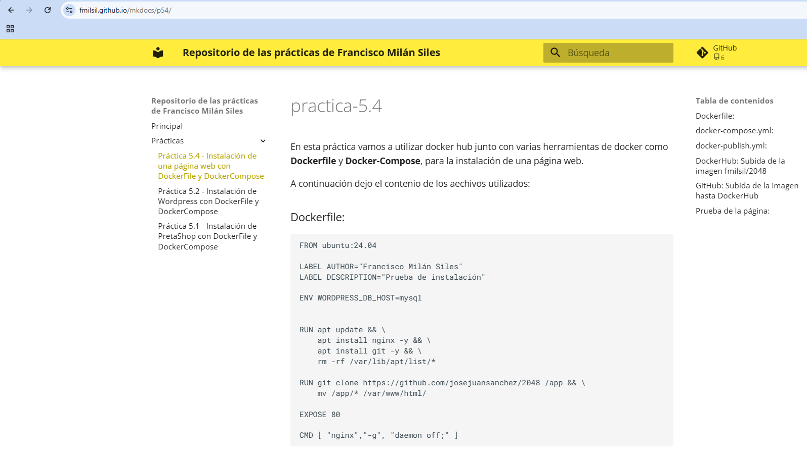

# mkdocs
En esta práctica vamos a crear un sitio web dinámico generado con **MKDocs Material** junto con la herramienta de GitHub llamada *GitHub Pages*.

A continuación explico los pasos para instalar el sitio web.

### Instalación y ejecución
Lo primero que tenemos que hacer es crear nuestro archivo `mkdocs.yml`:
```yml
#Configuración del sitio
site_name: Repositorio de las prácticas de Francisco Milán Siles
repo_url: "https://github.com/fmilsil"

#Cambios para el tema
theme: 
    name: "material"
    palette:
      primary: yellow
      accent: amber
    font:
      text: Open Sans
    language: es

    features:
      # Carga instantánea de las páginas
      - navigation.instant
      # Ancla de navegación para seguir la sección activa
      - navigation.tracking
      # Menús expandibles en la navegación
      - navigation.expand
      # Funciones de búsqueda mejoradas
      - search.suggest
      - search.highlight
      # Oculta la cabecera al hacer scroll
      - header.autohide
      # Agrega un pie de página con navegación
      - navigation.footer

#Configuración para la barra de navegación
nav:
    - Principal: index.md
    - Prácticas:
        #Lista de las prácticas con sus respectivas enlaces
        - "Práctica 5.4 - Instalación de una página web con DockerFile y DockerCompose": p54.md
        - "Práctica 5.2 - Instalación de Wordpress con DockerFile y DockerCompose": p52.md
        - "Práctica 5.1 - Instalación de PretaShop con DockerFile y DockerCompose": p51.md
```

Despues, procedemos con lanzar los contenedores encargados de la buil de la página y el despliegue en **GitHub Sites**:
```
docker run --rm -it -p 8000:8000 --user $(id -u):$(id -g) -v "$PWD":/docs squidfunk/mkdocs-material build
docker run --rm -it -p 8000:8000 --user $(id -u):$(id -g) -v "$PWD":/docs squidfunk/mkdocs-material gh-deploy
```


Y ya podemos acceder a nuestro sitio web mediante el siguiente enlace: [aquí](https://fmilsil.github.io/mkdocs/)

### Despliegue en GitHub Pages
El sitio se despliga de manera automatica en GitHub Pacges cada vez que actualizamos la rama `main`. Esto lo logramos creando un *Action* en GitHub.

```yml
name: build-push-mkdocs

# Eventos que desescandenan el workflow
on:
  push:
    branches: ["main"]

  workflow_dispatch:

# A workflow run is made up of one or more jobs that can run sequentially or in parallel
jobs:

  # Job para crear la documentación de mkdocs
  build:
    # Indicamos que este job se ejecutará en una máquina virtual con la última versión de ubuntu
    runs-on: ubuntu-latest
    
    # Definimos los pasos de este job
    steps:
      - name: Clone repository
        uses: actions/checkout@v4

      - name: Install Python3
        uses: actions/setup-python@v4
        with:
          python-version: 3.x

      - name: Install Mkdocs
        run: |
          pip install mkdocs
          pip install mkdocs-material 

      - name: Build MkDocs
        run: |
          mkdocs build

      - name: Push the documentation in a branch
        uses: s0/git-publish-subdir-action@develop
        env:
          REPO: self
          BRANCH: gh-pages # The branch name where you want to push the assets
          FOLDER: site # The directory where your assets are generated
          GITHUB_TOKEN: ${{ secrets.GITHUB_TOKEN }} # GitHub will automatically add this - you don't need to bother getting a token
          MESSAGE: "Build: ({sha}) {msg}" # The commit message
```


### Comprobación del sitio web
Cuando accedamos a nuestra página nos deberia de aparecer esto:




Con todo esto ya tendriamos listo nuestro servidor web :D
